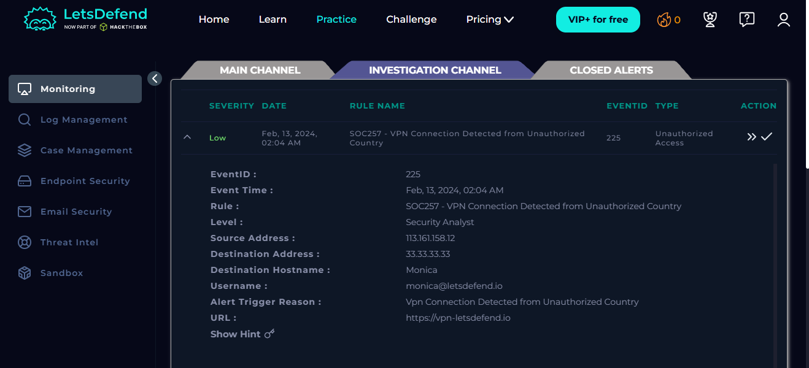

# EVENT 225 - VPN CONNECTION DETECTED FROM UNAUTHORIZED COUNTRY

## INFORMAÇÕES GERAIS

---

| ***DATA/HORA:*** | 13/02/2024 às 02:04 |
| --- | --- |
| ***SEVERIDADE:*** | Baixa |
| ***STATUS:*** | Escalado ao N2 |
| ***MITRE ATT&CK:*** | **Network Service Discovery - [T1046](https://attack.mitre.org/techniques/T1046/)
Brute Force - [T1110](https://attack.mitre.org/techniques/T1110/)
Credential Access - [TA0006](https://attack.mitre.org/tactics/TA0006/)
Valid Accounts - [T1078](https://attack.mitre.org/techniques/T1078/)** |

## DESCRIÇÃO

---

Identificado pelo SIEM o Acesso indevido ao serviço de VPN Corporativa (IP 33.33.33.33), proveniente de um endereço de rede (IP 113.161.158.12) localizado em um país não autorizado.

Detalhes do Evento de Segurança no SIEM.

## OBSERVAÇÃO

---

Trata-se da minha primeira análise e contato com um Evento de Segurança SOC, além da familiarização com a interface de um Ambiente SIEM.

Sendo assim, conforme será identificado na seção de **Lições Aprendidas**, as etapas não foram realizadas da maneira mais eficiente, levando em consideração um ambiente corporativo real.

## INVESTIGAÇÃO

---

- ***ETAPA 1 - CONFIRMAÇÃO E IDENTIFICAÇÃO DO ATOR MALICIOSO***
    
    Antes de qualquer ação, torna-se necessário confirmar se o IP de Origem associado ao acesso realmente corresponde a um Ator Malicioso.
    
    Para isso, uma consulta por tal endereço foi realizada na plataforma [VirusTotal](https://www.virustotal.com/gui/home/search), a qual associou-o à tentativas de Bruteforce SSH, confirmando a conduta **maliciosa**.
    
    Adicionalmente, confirma-se sua localização geográfica: **Vietnã**.
    
    
    
    Resultado da pesquisa do IP no VirusTotal.
    
- ***ETAPA 2 - ANÁLISE DO ENDPOINT DA COLABORADORA***
    
    Uma primeira análise foi realizada no Endpoint da Monica (colaboradora afetada pelo evento).
    
    
    
    Análise do Endpoint da colaboradora afetada. 
    
    Aqui, foram procurados Eventos de Rede que correspondessem ao acesso indevido indicado no Evento de Segurança do SIEM, ou que indicassem comprometimento do Dispositivo de Borda.
    
    
    
    Filtro de “IP de Origem” aplicado.
    
    
    
    Filtro de “Horário do Evento” aplicado.
    
    A princípio, **não foi constatado nenhum padrão anômalo de rede** que pudesse estar relacionado ao Evento de Segurança gerado pelo SIEM.
    
- ***ETAPA 3 - ANÁLISE DO E-MAIL DA COLABORADORA***
    
    A próxima investigação foi realizada no serviço de Correio Eletrônico, onde, filtrando pelo nome da Colaboradora, foram identificados **três e-mails recebidos contendo um Código do Processo de MFA *(Multifactor Authentication)***.
    
    
    
    E-mails da Monica.
    
    **Confirma-se a relação de tais e-mails com o Evento de Segurança**, pois o IP e local solicitantes são os mesmos identificados como maliciosos anteriormente.
    
    
    
    Corpo do E-mail contendo o IP e o Local Solicitante.
    
    
    
    Pesquisa do Local no Google.
    
    Considerando que, normalmente o Código de Utilização Única é a última etapa do processo de MFA do login, pode-se concluir que, foram **utilizadas as credenciais** da Monica (login e senha) para o acesso, evidenciando um possível **vazamento de credenciais**.
    
    Ressalta-se que, **não foram identificados e-mails contendo tentativas de Phishing, confirmando o acesso ao Serviço de VPN ou a qualquer outro serviço,** porém, torna-se necessária a investigação dos logs para confirmar estes últimos.
    
- ***ETAPA 4 - ANÁLISE DE LOGS***
    
    Levando em consideração que, o SIEM relacionou somente um Endereço IP malicioso ao Evento de Segurança, somente este foi utilizado como filtro, sendo possível identificar 21 Logs.
    
    Ressalta-se que o Endereço de Destino de todos os logs exibidos é tão **somente o serviço de VPN Corporativa**.
    
    
    
    Logs do Endereço IP malicioso.
    
    Os primeiros evidenciam requisições direcionadas à diversas portas diferentes do servidor, comportamento compatível com **Port Scanning**.
    
    
    
    Detalhes de um dos Logs evidenciando Port Scanning. 
    
    Já os Eventos conseguintes demonstram **tentativas mal sucedidas de exploração da Porta HTTPS 443**, normalmente pública, **utilizando as credenciais da Colaboradora**, confirmando a tese de **comprometimento de tais.**
    
    O insucesso dessas tentativas se dá justamente pela falta de utilização do Código MFA correto, enviado ao e-mail da Monica, conforme visto anteriormente.
    
    
    
    Detalhes de um dos Logs evidenciando a utilização das credenciais.
    
    
    
    Detalhes de um dos Logs detalhando a requisição HTTP POST.
    

## CONCLUSÃO E MEDIDAS SUGERIDAS

---

Levando em consideração os fatos analisados, conclui-se que, ainda que o Evento em seu atual escopo possua **Baixa Severidade**, há indícios de **comprometimento de credenciais da Colaboradora**, não sendo possível mensurar sua real extensão, caso estas sejam exploradas de outras maneiras, por esse motivo, opta-se pela sua escalação.

Ao Time N2, recomenda-se:

- Criação e aplicação de **regra no Firewall de Borda para bloquear o IP Malicioso** (113.161.158.12).
- **Bloqueio imediato da conta associada ao e-mail** (onde, no próximo acesso, deverá ser solicitada a troca da senha), além da **revogação de todas as sessões ativas**.
- **Isolamento temporário do Endpoint da Colaboradora**, para que este seja **escaneado com um Antivírus (**ou analisado manualmente) em busca de Malwares que possam ter comprometido as suas credenciais.
- Investigação de Threat Intelligence em bancos de dados da Internet (incluindo DarkWeb) a fim de se verificar se houve vazamento massivo de credenciais, ou se foi um caso isolado.

### **LIÇÕES APRENDIDAS**

---

Somente após a conclusão da investigação foi identificado a existência de um Playbook na plataforma com os os passos a serem seguidos, portanto, para fins de agilidade nas próximas investigações, tal documento será devidamente considerado.

Por fim, ressalta-se que, durante a análise foram levantadas hipóteses e soluções extrapolam o escopo do alerta analisado, os quais, em um cenário corporativo real, justificariam uma investigação complementar ou abertura de um novo incidente.
